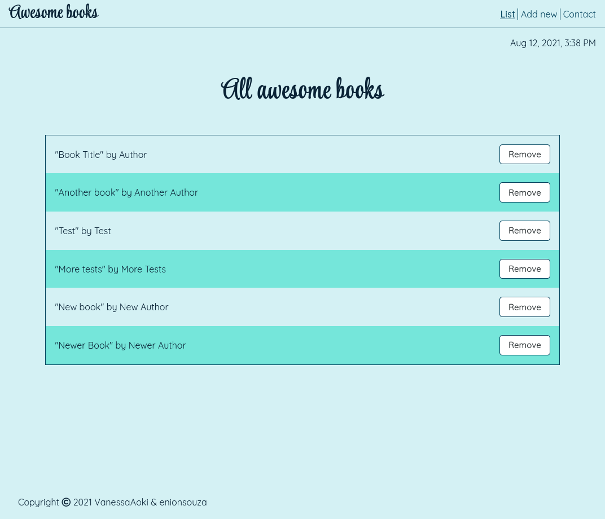
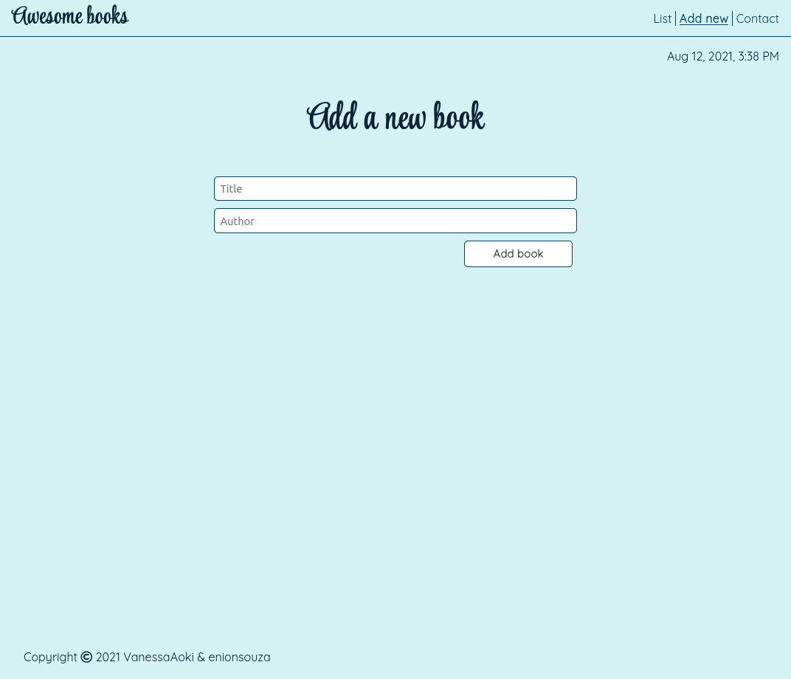
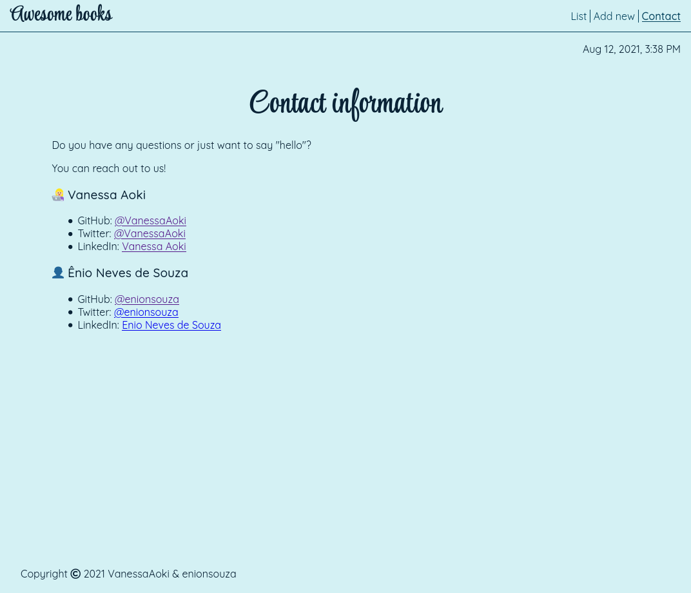

<p align="center">
  <a href="https://www.microverse.org/">
    
  </a>
  <a href="https://github.com/VanessaAoki/AwesomeBooks/blob/main/LICENSE">
    
  </a>
  <a href="https://github.com/VanessaAoki/AwesomeBooks">
    
  </a>
  <a href="https://github.com/VanessaAoki/AwesomeBooks">
    
  </a>
</p>

# Awesome Books

<p align="center">
    
    <br>
    
    <br>
    
</p>

## Built With

- HTML, CSS & JavaScript;
- Visual Studio, Git & GitHub;

## Getting Started

### Running locally
To run this project, you only need a computer with a browser (like Google Chrome, Mozilla Firefox, Microsoft Edge, Apple Safari, etc.) installed, and follow these steps:

1. In your terminal, type the following, to clone this repository:

```sh
git clone git@github.com:VanessaAoki/AwesomeBooks.git
```

2. Type `$ cd AwesomeBooks` to move to the project folder;

3. Open the `index.html` file and run the application;

### Live demo
Alternatively, you can run the app through the [live demo link](https://rawcdn.githack.com/VanessaAoki/AwesomeBooks/3ca746caa2332a3bc69bb2846545a09298e8045f/index.html).

## Author

👩🏼‍💻 **Vanessa Aoki**

- GitHub: [@VanessaAoki](https://github.com/VanessaAoki)
- Twitter: [@VanessaSAoki](https://twitter.com/VanessaSAoki)
- Linkedin: [Vanessa Aoki](https://www.linkedin.com/in/vanessasaoki/)

👤 **Ênio Neves de Souza**

- GitHub: [@enionsouza](https://github.com/enionsouza)
- Twitter: [@enionsouza](https://twitter.com/enionsouza)
- LinkedIn: [Enio Neves de Souza](https://www.linkedin.com/in/enio-neves-de-souza/)

## 🤝 Contributing

Contributions, issues, and feature requests are welcome!

Feel free to check the [issues page](https://github.com/VanessaAoki/AwesomeBooks/issues).

## Show your support

Give a ⭐️ if you like this project!

## 📝 License

This project is [MIT](./LICENSE) licensed.
